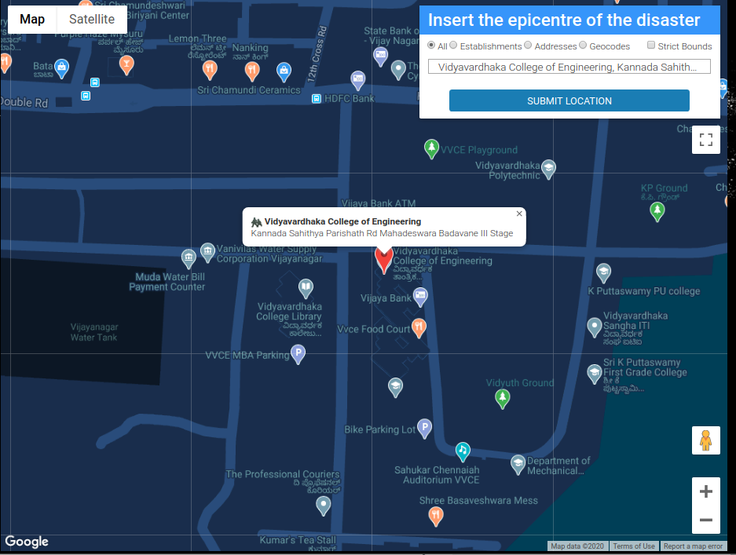
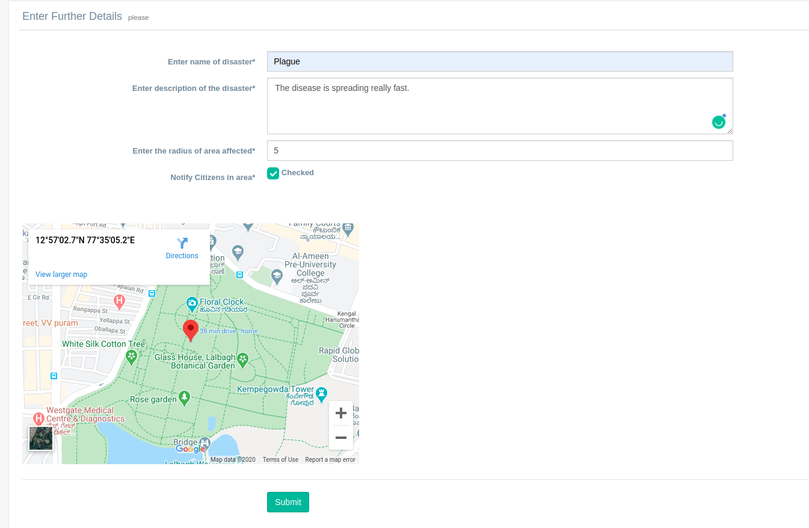
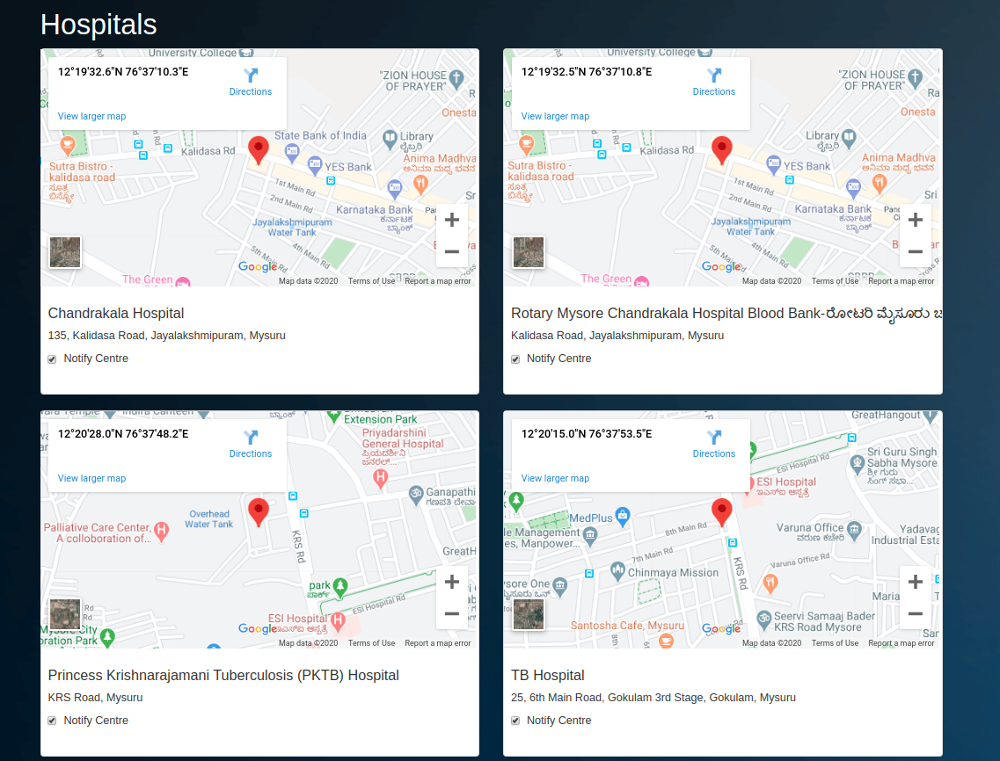
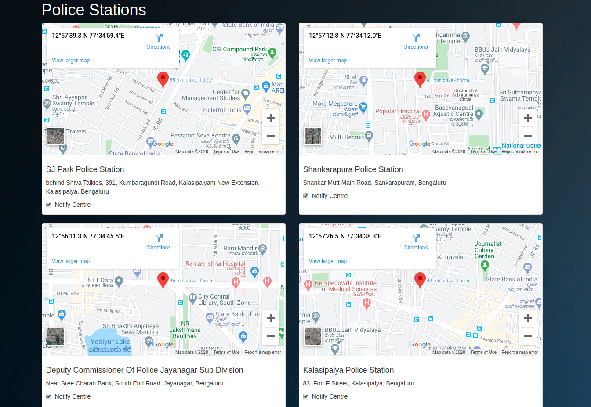
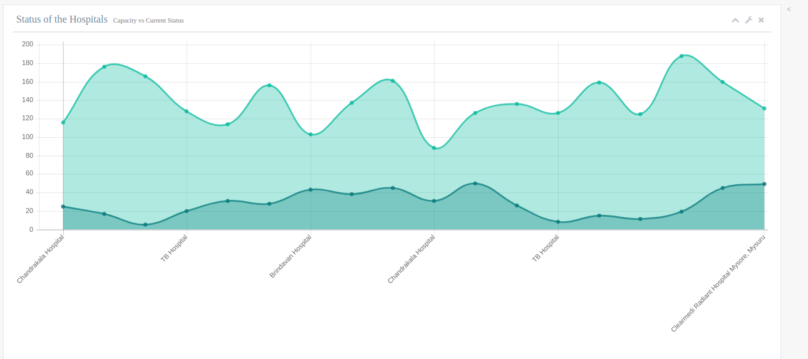
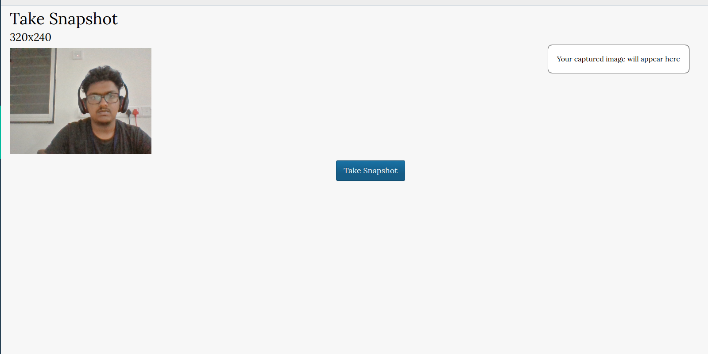
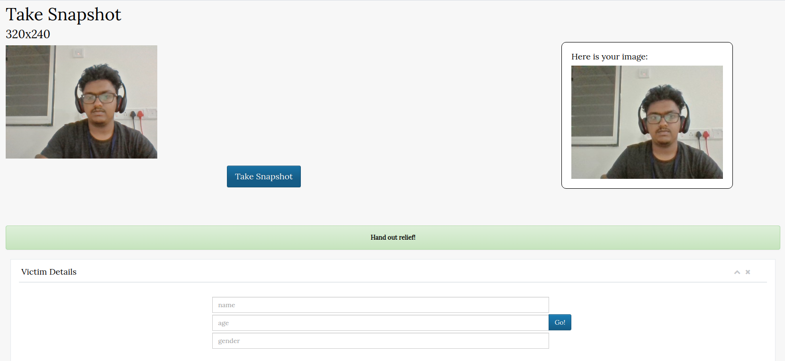
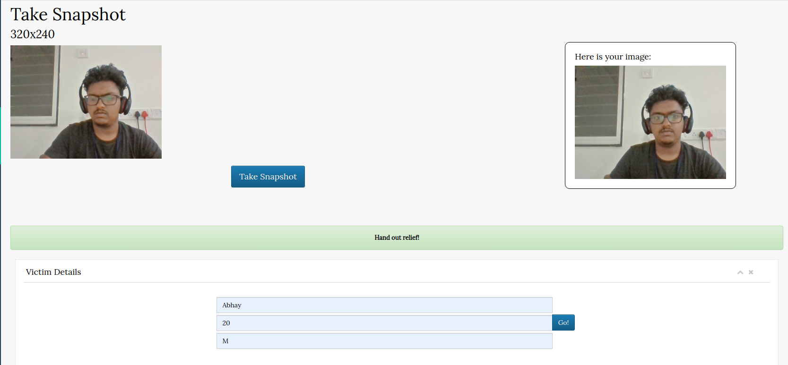
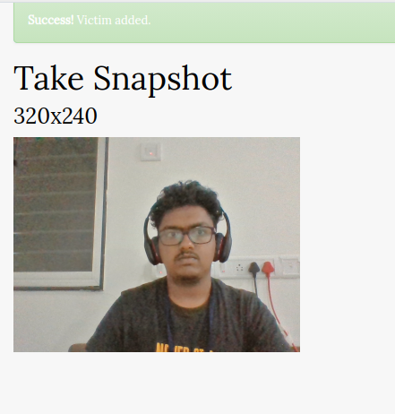
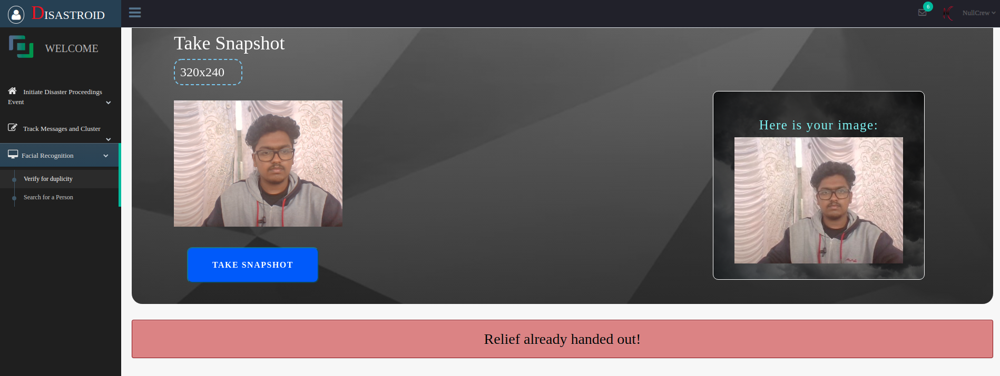

# Disastroid

A one-stop solution to avoid getting caught in disasters.

## Features

* Remote monitoring of disaster and relief response.

* Automated suggestions of healthcare centres/police stations to triage relief from.

* SMS alerts to victims in the area with directions to the nearest relief centre.

* Monitoring of hospitals in the area.

* Heatmap generation with the location of victims in the region to direct response.

* Citizens in case of a disaster can send SMS's to the authority. This SMS stream will be monitored and keyword clustering will be carried out to initiate a response. 

* Facial recognition to hand out relief. Photos of victims to be taken at the centre. Facial recognition will determine if relief has already been handed out to a particular individual at the centre.

* The families can search for their relatives by just uploading their photos.

## Video:

[](https://www.youtube.com/watch?v=elCnni0xKNk)


## Screenshots

### Initiate Disaster




### Hospital recommendations



### Police station  recommendations




### Hospital Monitoring



### Citizen Statistics


### Facial Recognition for relief







## Prerequisites

* OS: Windows, Linux or Mac
* Python 3 installed
* RAM: 8 GB or more
* Processor: Intel i5 (and its equivalents) or higher
* Webcam

## Installation Guidelines

1. Clone the repository:
`git clone https://github.com/NullCrew/Disastroid.git`
2. Switch to the project directory:
`cd Disastroid`
3. Install dependencies:
`pip3 install -r "requirements.txt"`
4. Add your API keys in .env file:
```
TWILIO_SID=<Add your twilio account SID here>
TWILIO_TOK=<Add your twilio authentication token here>
TWILIO_NUM=<Add your twilio phone number here>
```
5. Start the server:
`python3 manage.py runserver`
6. Navigate to the site:
`http://localhost:8000`


# A NullCrew Project


